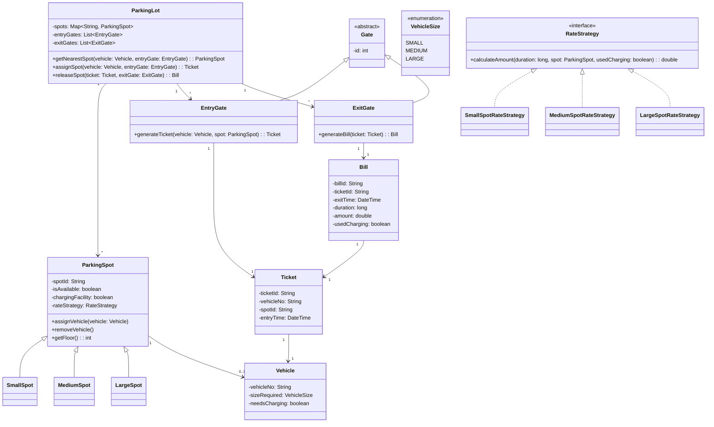

# Parking Lot System - Class Diagram

## Key Components

### Core Classes
- **ParkingLot**: Main system controller managing spots and gates
- **Gate**: Abstract base class for entry/exit points
- **Vehicle**: Represents vehicles with size and charging requirements
- **ParkingSpot**: Individual parking spaces with different types

### Design Patterns Used
- **Strategy Pattern**: RateStrategy for different pricing models
- **Inheritance**: Vehicle sizes and spot types
- **Composition**: ParkingLot contains spots and gates

### Features
- Electric vehicle charging facilities
- Flexible rate calculation strategies
- Ticket and billing system
- Multiple entry/exit gates